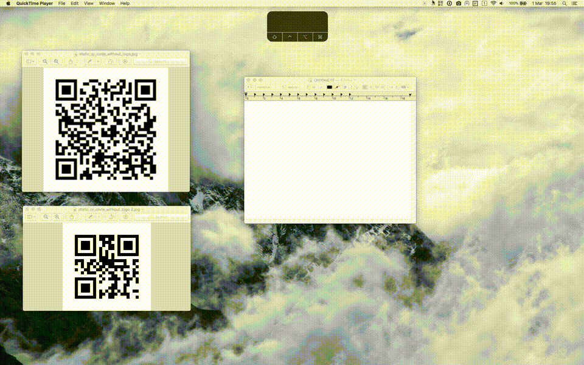

# MenuBarCodeReader

This is a small mac utility to quickly and seamlessly scan QR codes (or other bar codes) which are visible on your screen. The app nests itself in your menu bar. On succesful scans the parsed data is available on your clipboard.

### Release notes

v1.0
- first application release
- start scanning through menu action or global hotkey
- scan by selecting an area on the screen
- visual indication on success/failure
- succesful scans copy the data to the clipboard

v2.0
- scan results can be shown in the notification center
- preferences pane: adjustable shortcut keys, customize what happens with scan results
- click to scan: instead of selecting where the qr code is, simply click where the code is and the application will attempt to figure it out
- auto-update framework: updating / new feature notifications from inside the application

v2.1
- fixed some issues on macOS Mojave

Icons made by [Pixel perfect](https://www.flaticon.com/authors/pixel-perfect) from [www.flaticon.com](https://www.flaticon.com/) is licensed by [CC 3.0 BY](http://creativecommons.org/licenses/by/3.0/)