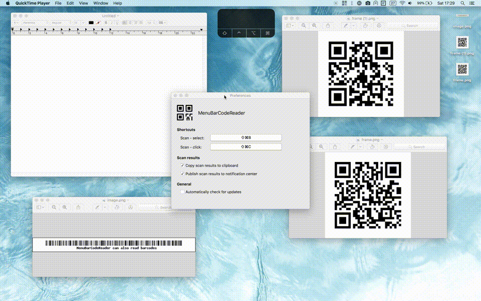

# MenuBarCodeReader

This is a small mac utility to quickly and seamlessly scan QR codes (or other bar codes) which are visible on your screen. The app nests itself in your menu bar. On succesful scans the parsed data is available on your clipboard.

### Roadmap

- Preferences => customize shortcut key, use notifications instead of clipboard, startup at boot
- Auto update / check for updates
- History?

Icons made by [Pixel perfect](https://www.flaticon.com/authors/pixel-perfect) from [www.flaticon.com](https://www.flaticon.com/) is licensed by [CC 3.0 BY](http://creativecommons.org/licenses/by/3.0/)